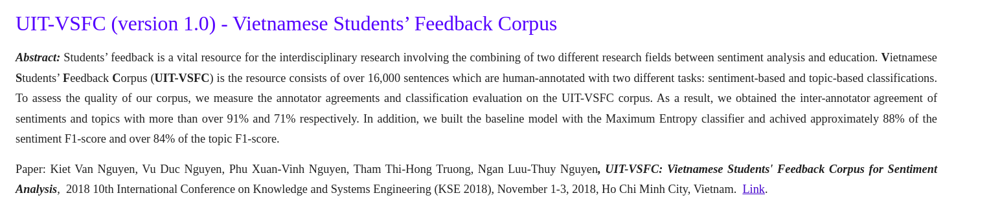
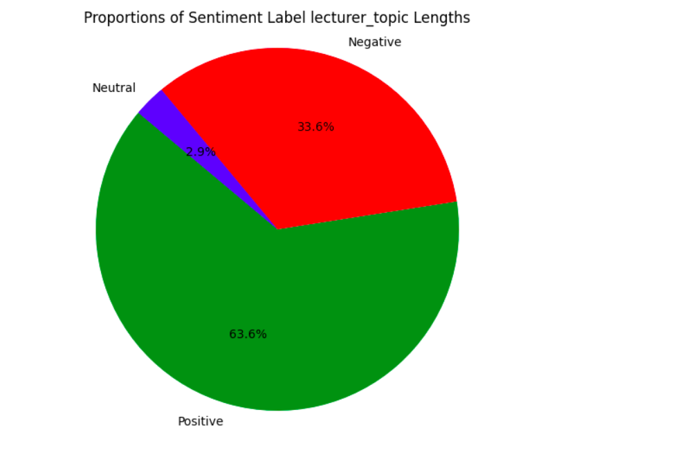
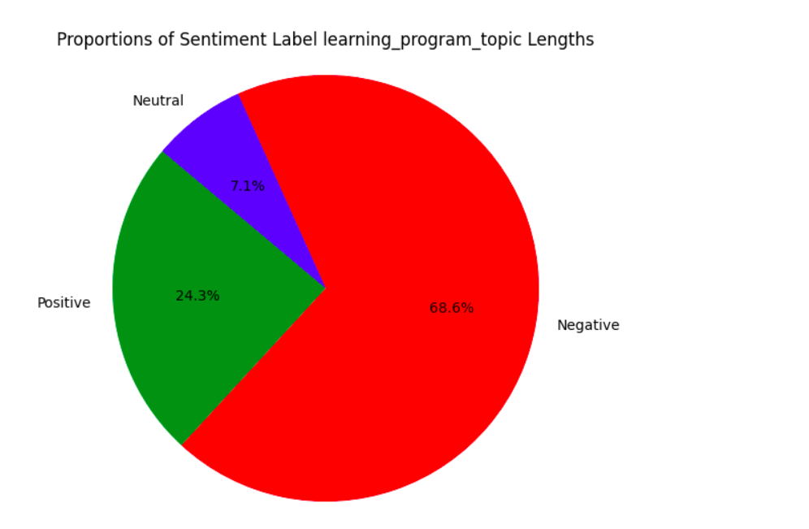
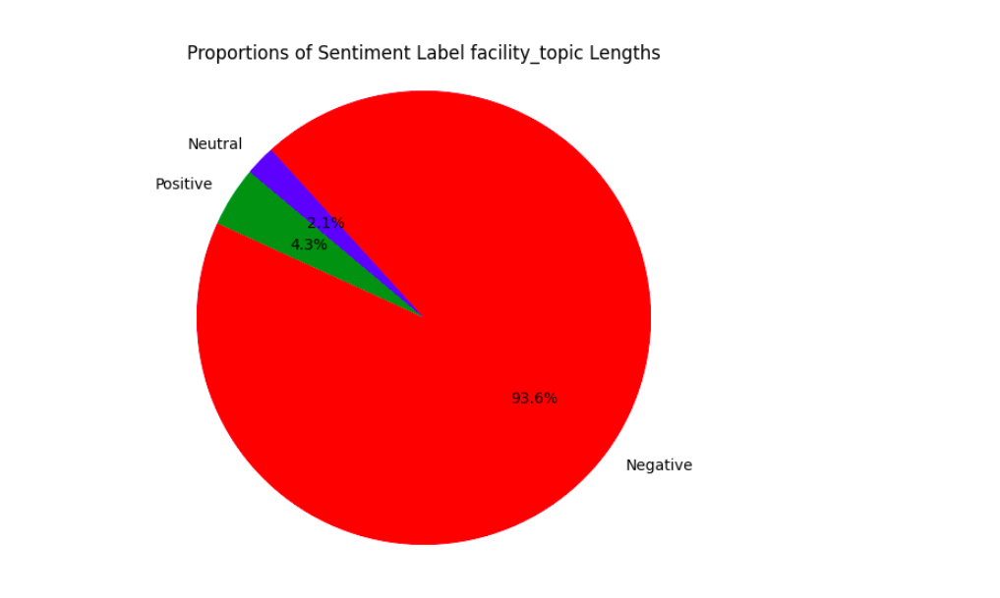
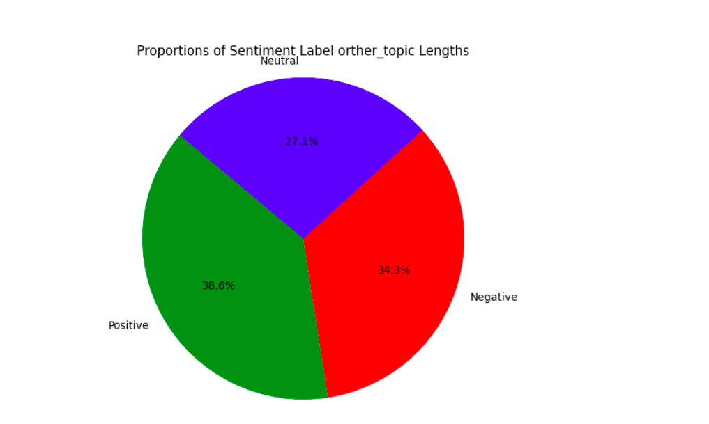

# School sentiment analysts 

## The dataset 
Link : [UIT-VSFC (version 1.0) - Vietnamese Students’ Feedback Corpus](https://nlp.uit.edu.vn/datasets/#h.p_4Brw8L-cbfTe) \
 Using Vietnamese Students’ Feedback Corpus. \
 Students’ feedback is a vital resource for research fields sentiment analysis for education.

 

## Fineturn on RoBERTa model 
Hyperparameters :
```
num_labels = 3
batch_size = 32
learning_rate = 2e-5
num_epochs = 6
```
Accuracy on the evaluation set: 0.9220 

## Pipeline on Huggingface
Link : [hieudinhpro/BERT_Sentiment_Vietnamese](https://huggingface.co/hieudinhpro/BERT_Sentiment_Vietnamese)
```
conda activate ML_PipeLine
```
```
# Use a pipeline as a high-level helper
from transformers import pipeline

pipe = pipeline("text-classification", model="hieudinhpro/BERT_Sentiment_Vietnamese")
```

## Sentiment Analysis 
Some of charts visualization predicted 





## Using API
To run the FastAPI server, use the command:
```
uvicorn main:app --reload
```
Testing the API
```
curl -X POST "http://127.0.0.1:8000/predict" -H "Content-Type: application/json" -d '{"text": "Tôi rất vui"}'
```

## Using Docker 
```
docker pull hieudinhpro/school_sentiment_analysts:v1
```
```
docker run -p 8501:8501 hieudinhpro/school_sentiment_analysts:v1
```


