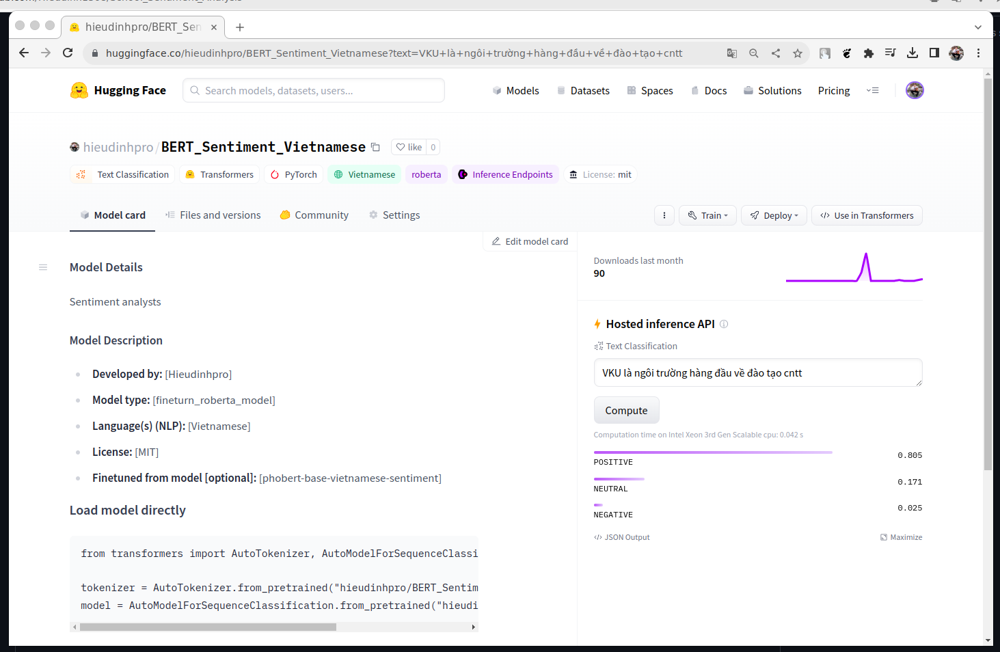

# School sentiment analysts 

## The dataset 
 Using Vietnamese Students’ Feedback Corpus. \
 Students’ feedback is a vital resource for the interdisciplinary research fields between sentiment analysis for education.
## Fineturn on RoBERTa model 
Hyperparameters :
```
num_labels = 3
batch_size = 32
learning_rate = 2e-5
num_epochs = 6
```
Accuracy on the evaluation set: 0.9220 

## Pipeline on Huggingface
Link : [hieudinhpro/BERT_Sentiment_Vietnamese](https://huggingface.co/hieudinhpro/BERT_Sentiment_Vietnamese)



## Using Docker 
```
docker pull hieudinhpro/school_sentiment_analysts:v1
```
```
docker run -p 8501:8501 hieudinhpro/school_sentiment_analysts:v1
```


